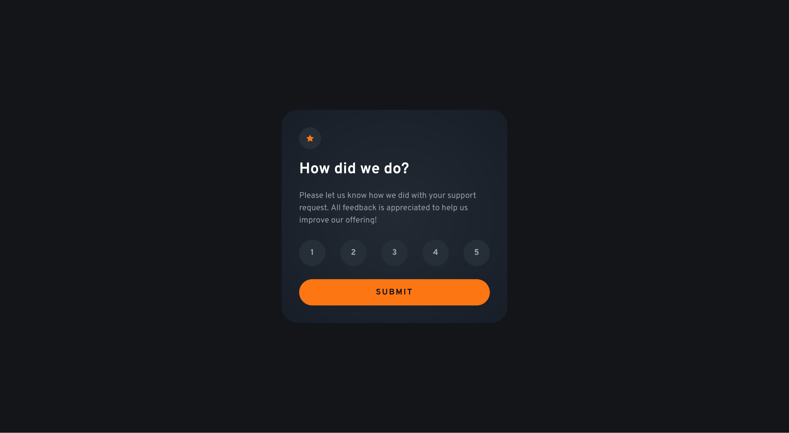

# Frontend Mentor - Interactive rating component solution

This is a solution to the [Interactive rating component challenge on Frontend Mentor](https://www.frontendmentor.io/challenges/interactive-rating-component-koxpeBUmI). Frontend Mentor challenges help you improve your coding skills by building realistic projects.

## Table of contents

- [Overview](#overview)
  - [The challenge](#the-challenge)
  - [Screenshot](#screenshot)
  - [Links](#links)
- [My process](#my-process)
  - [Built with](#built-with)
  - [What I learned](#what-i-learned)
  - [Continued development](#continued-development)
  - [Useful resources](#useful-resources)
- [Author](#author)

## Overview

### The challenge

Users should be able to:

- View the optimal layout for the app depending on their device's screen size
- See hover states for all interactive elements on the page
- Select and submit a number rating
- See the "Thank you" card state after submitting a rating

### Screenshot

### Links

- Solution URL: [https://github.com/gmagnenat/interactive-rating-component](https://github.com/gmagnenat/interactive-rating-component)
- Live Site URL: [https://clever-hotteok-1d1505.netlify.app/](https://clever-hotteok-1d1505.netlify.app/)

## My process

### Built with

- Semantic HTML5 markup
- SCSS
- Flexbox
- CSS Grid
- Mobile-first workflow
- Vite
- Typescript

### What I learned

**Code organisation in my script file**

- I added an interface for the type of the different DOM elements. I added an object to regroup all my css classes so I can get the available classes quickly in my code.
- I added a function to get all the DOM elements and check if they are present. It also throws an error if a DOM element is missing.

I practiced how to use FormData and the `get()` method to easily get entry values from a form after submission.
I practiced the use of popstate and pushstate events to interact with the history stack and rewrite the current url.

### Useful resources

- [FormData on MDN](https://developer.mozilla.org/en-US/docs/Web/API/FormData) - This helped me understand the different methods available in FormData
- [Window: popstate event on MDN](https://developer.mozilla.org/en-US/docs/Web/API/Window/popstate_event) - This helps me understand the popstate and pushstate events and how to interact with the history stack.

## Author

- Website - [Gwenael Magnenat](https://gmagnenat.com)
- Frontend Mentor - [@gmagnenat](https://www.frontendmentor.io/profile/gmagnenat)
- LinkedIn - [@gmagnenat](https://linkedin.com/in/gmagnenat)
